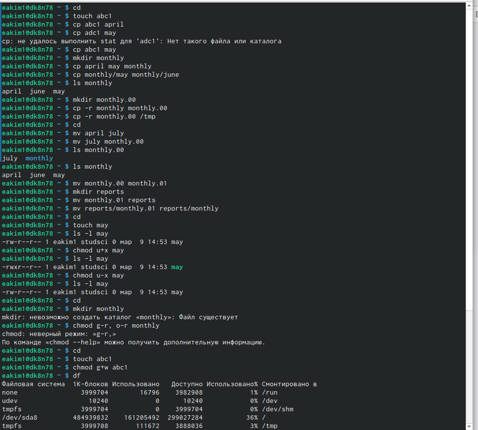

---
## Front matter
lang: ru-RU
title: Лабораторная работа №5
subtitle: Основы интерфейса взаимодействия пользователя с системой Unix на уровне командной строки
author:
  - Ким Э.А
institute:
  - Российский университет дружбы народов, Москва, Россия

## i18n babel
babel-lang: russian
babel-otherlangs: english

## Formatting pdf
toc: false
toc-title: Содержание
slide_level: 2
aspectratio: 169
section-titles: true
theme: metropolis
header-includes:
 - \metroset{progressbar=frametitle,sectionpage=progressbar,numbering=fraction}
 - '\makeatletter'
 - '\beamer@ignorenonframefalse'
 - '\makeatother'
---

# Информация

## Докладчик

:::::::::::::: {.columns align=center}
::: {.column width="70%"}

  * Ким Эрика Алексеевна 
  * НБИ-02-22
  * РУДН 

:::
::: {.column width="30%"}

:::
::::::::::::::

## Цели и задачи

- Ознакомление с файловой системой Linux, её структурой, именами и содержанием каталогов. Приобретение практических навыков по применению команд для работы с файлами и каталогами, по управлению процессами (и работами), по проверке использования диска обслуживанию файловой системы.

## Этапы работы

1. Выполняем все примеры, приведенные в первой части описания лабораторной работы

{#fig:001 width=90%}

##

2. Копируем файл и перемещаем его в домашнюю папку
 
{#fig:002 width=90%}

##

3. Создаем директорию
 
{#fig:003 width=90%}

##

4. Перемещаем и переименовываем файл
  
{#fig:005 width=90%}  

##
  
5. Создаем файл

{#fig:006 width=90%}

##

6.  Создаем каталог 
  
{#fig:008 width=90%}

##

7. Перемещаем файлы в каталог
  
{#fig:010 width=90%}

##

8. Создаем и перемещаем каталог 

{#fig:011 width=90%}

##

9. Определяем опции команды chmod, необходимые для того, чтобы присвоить перечис-
ленным ниже файлам выделенные права доступа

{#fig:013 width=90%} 

##

10.  Копируем файл, перемещаем файл, копируем каталог, перемещаем каталог, лишаем владельца файла

{#fig:014 width=90%}

##

11. Прочитаем van по разным командам 
 
 {#fig:016 width=90%}
  
## Вывод 

- мы молодцы 

:::

