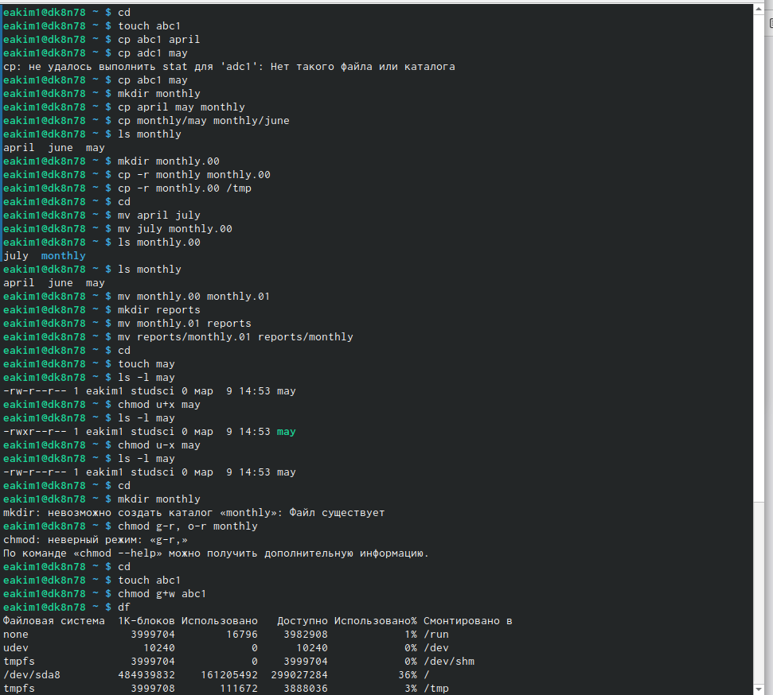
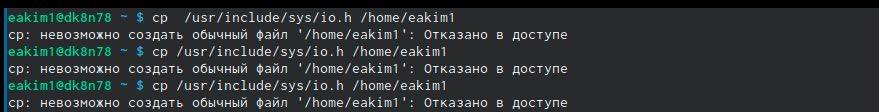
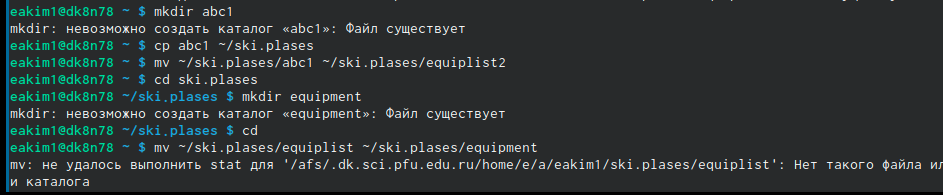
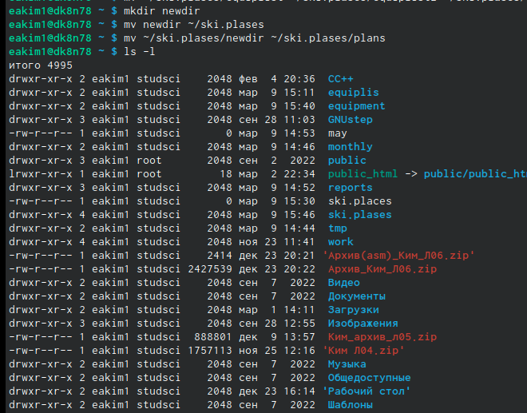
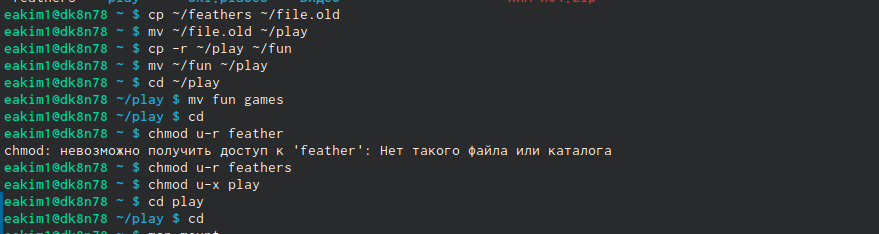
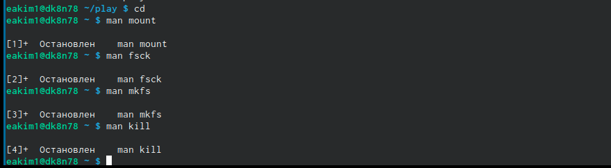

---
## Front matter
title: "Лабораторная рбота №5"
subtitle: "Основы интерфейса взаимодействия пользователя с системой Unix на уровне командной строки"
author: "Ким Эрика Алексеевна"

## Generic otions
lang: ru-RU
toc-title: "Содержание"

## Bibliography
bibliography: bib/cite.bib
csl: pandoc/csl/gost-r-7-0-5-2008-numeric.csl

## Pdf output format
toc: true # Table of contents
toc-depth: 2
lof: true # List of figures
lot: true # List of tables
fontsize: 12pt
linestretch: 1.5
papersize: a4
documentclass: scrreprt
## I18n polyglossia
polyglossia-lang:
  name: russian
  options:
	- spelling=modern
	- babelshorthands=true
polyglossia-otherlangs:
  name: english
## I18n babel
babel-lang: russian
babel-otherlangs: english
## Fonts
mainfont: PT Serif
romanfont: PT Serif
sansfont: PT Sans
monofont: PT Mono
mainfontoptions: Ligatures=TeX
romanfontoptions: Ligatures=TeX
sansfontoptions: Ligatures=TeX,Scale=MatchLowercase
monofontoptions: Scale=MatchLowercase,Scale=0.9
## Biblatex
biblatex: true
biblio-style: "gost-numeric"
biblatexoptions:
  - parentracker=true
  - backend=biber
  - hyperref=auto
  - language=auto
  - autolang=other*
  - citestyle=gost-numeric
## Pandoc-crossref LaTeX customization
figureTitle: "Рис."
tableTitle: "Таблица"
listingTitle: "Листинг"
lofTitle: "Список иллюстраций"
lotTitle: "Список таблиц"
lolTitle: "Листинги"
## Misc options
indent: true
header-includes:
  - \usepackage{indentfirst}
  - \usepackage{float} # keep figures where there are in the text
  - \floatplacement{figure}{H} # keep figures where there are in the text
---

# Цель работы

Ознакомление с файловой системой Linux, её структурой, именами и содержанием каталогов. Приобретение практических навыков по применению команд для работ с файлами и каталогами, по управлению процессами (и работами), по проверке использования диска и обслуживанию файловой системы.

# Выполнение лабораторной работы

1. Выполняем все примеры, приведенные в первой части описания лабораторной работы

{#fig:001 width=90%}

2. Копируем файл и перемещаем его в домашнюю папку
 
{#fig:002 width=90%}

3. Создаем директорию
 
{#fig:003 width=90%}

4. Перемещаем и переименовываем файл
  
{#fig:005 width=90%}  
  
5. Создаем файл

{#fig:006 width=90%}

  
6.  Создаем каталог 
  
{#fig:008 width=90%}

7. Перемещаем файлы в каталог
  
{#fig:010 width=90%}

8. Создаем и перемещаем каталог 

{#fig:011 width=90%}

9. Определяем опции команды chmod, необходимые для того, чтобы присвоить перечис-
ленным ниже файлам выделенные права доступа

{#fig:013 width=90%} 

10.  Копируем файл, перемещаем файл, копируем каталог, перемещаем каталог, лишаем владельца файла

{#fig:014 width=90%}

11. Прочитаем van по разным командам 
 
 {#fig:016 width=90%}
  
  
  
# Выводы

Ознакомились с файловой системой линукс 

# Список литературы{.unnumbered}

::: {#refs}
:::
