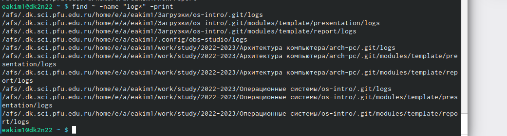

---
## Front matter
lang: ru-RU
title: Лабораторная работа №6
subtitle: Ознакомление с файловой системой Linux, её структурой, именами и содержанием каталогов. Приобретение практических навыков по применению команд для работы с файлами и каталогами, по управлению процессами (и работами), по проверке использования диска обслуживанию файловой системы.
author:
  - Ким Э.А
institute:
  - Российский университет дружбы народов, Москва, Россия

## i18n babel
babel-lang: russian
babel-otherlangs: english

## Formatting pdf
toc: false
toc-title: Содержание
slide_level: 2
aspectratio: 169
section-titles: true
theme: metropolis
header-includes:
 - \metroset{progressbar=frametitle,sectionpage=progressbar,numbering=fraction}
 - '\makeatletter'
 - '\beamer@ignorenonframefalse'
 - '\makeatother'
---

# Информация

## Докладчик

:::::::::::::: {.columns align=center}
::: {.column width="70%"}

  * Ким Эрика Алексеевна 
  * НБИ-02-22
  * РУДН 

:::
::: {.column width="30%"}

:::
::::::::::::::

## Цели и задачи

- Ознакомление с файловой системой Linux, её структурой, именами и содержанием каталогов. Приобретение практических навыков по применению команд для работы с файлами и каталогами, по управлению процессами (и работами), по проверке использования диска обслуживанию файловой системы.

## Этапы работы

1. Запишите в файл file.txt названия файлов, содержащихся в каталоге /etc. Допи-
шите в этот же файл названия файлов, содержащихся в вашем домашнем каталоге

{#fig:001 width=90%}

##

2. Выведите имена всех файлов из file.txt, имеющих расширение .conf, после чего
запишите их в новый текстовой файл conf.txt.
 
{#fig:002 width=90%}

##

3. Определите, какие файлы в вашем домашнем каталоге имеют имена, начинавшиеся
с символа c? Предложите несколько вариантов, как это сделать.
 
{#fig:003 width=90%}

##

4. Выведите на экран (по странично) имена файлов из каталога /etc, начинающиеся
с символа h.
  
{#fig:004 width=90%} 

{#fig:005 width=90%}

##
  
5. Запустите в фоновом режиме процесс, который будет записывать в файл ~/logfile
файлы, имена которых начинаются с log.

{#fig:006 width=90%}

##

6.  Удалите файл ~/logfile.
  
{#fig:007 width=90%}

##

{#fig:008 width=90%}

##

7. Определите идентификатор процесса gedit, используя команду ps, конвейер и фильтр
grep. Как ещё можно определить идентификатор процесса

{#fig:09 width=90%}

##

8. Прочтите справку (man) команды kill, после чего используйте её для завершения
процесса gedit

{#fig:010 width=90%}

##

9. Выполните команды df и du, предварительно получив более подробную информацию
об этих командах, с помощью команды man.

{#fig:011 width=90%} 

{#fig:012 width=90%}

##

10.  Воспользовавшись справкой команды find, выведите имена всех директорий, имею-
щихся в вашем домашнем каталоге..

{#fig:013 width=90%}

  
## Вывод 

- мы молодцы 

:::
