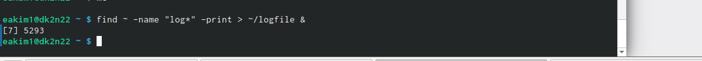

---
## Front matter
lang: ru-RU
title: Лабораторная работа №7
subtitle: Освоение основных возможностей командной оболочки Midnight Commander. Приобетение навыков практической работы по просмотру каталогов и файлов; манипуляций с ними.
author:
  - Ким Э.А
institute:
  - Российский университет дружбы народов, Москва, Россия

## i18n babel
babel-lang: russian
babel-otherlangs: english

## Formatting pdf
toc: false
toc-title: Содержание
slide_level: 2
aspectratio: 169
section-titles: true
theme: metropolis
header-includes:
 - \metroset{progressbar=frametitle,sectionpage=progressbar,numbering=fraction}
 - '\makeatletter'
 - '\beamer@ignorenonframefalse'
 - '\makeatother'
---

# Информация

## Докладчик

:::::::::::::: {.columns align=center}
::: {.column width="70%"}

  * Ким Эрика Алексеевна 
  * НБИ-02-22
  * РУДН 

:::
::: {.column width="30%"}

:::
::::::::::::::

## Цели и задачи

- Освоение основных возможностей командной оболочки Midnight Commander. Приобетение навыков практической работы по просмотру каталогов и файлов; манипуляций с ними.

## Этапы работы

1. Изучите информацию о mc, вызвав в командной строке man mc.

{#fig:001 width=90%}

##

2. Запустите из командной строки mc, изучите его структуру и меню.
 
{#fig:002 width=90%}

##

3. Создайте текстовой файл text.txt.
 
{#fig:003 width=90%}

4. Откройте этот файл с помощью встроенного в mc редактора.
  
{#fig:004 width=90%} 

##

5. Вставьте в открытый файл небольшой фрагмент текста, скопированный из любого
другого файла или Интернета.

{#fig:005 width=90%}

##

6.  Проделайте с текстом следующие манипуляции, используя горячие клавиши:
Выделите фрагмент текста и скопируйте его на новую строку.
  
{#fig:006 width=90%}

##

7. Перейдите в конец файла (нажав комбинацию клавиш) и напишите некоторый
текст.

{#fig:07 width=90%}

##

8. Перейдите в начало файла (нажав комбинацию клавиш) и напишите некоторый
текст.

{#fig:08 width=90%}

##

9. Сохраните и закройте файл.

{#fig:09 width=90%} 

##

10.  Откройте файл с исходным текстом на некотором языке программирования (напри-
мер C или Java).Используя меню редактора, включите подсветку синтаксиса, если она не включена,
или выключите, если она включена.

{#fig:010 width=90%}

  
## Вывод 

- мы молодцы 

:::
