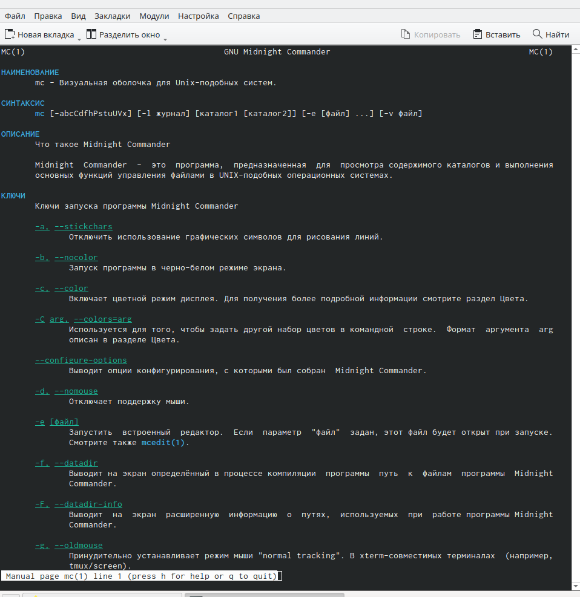
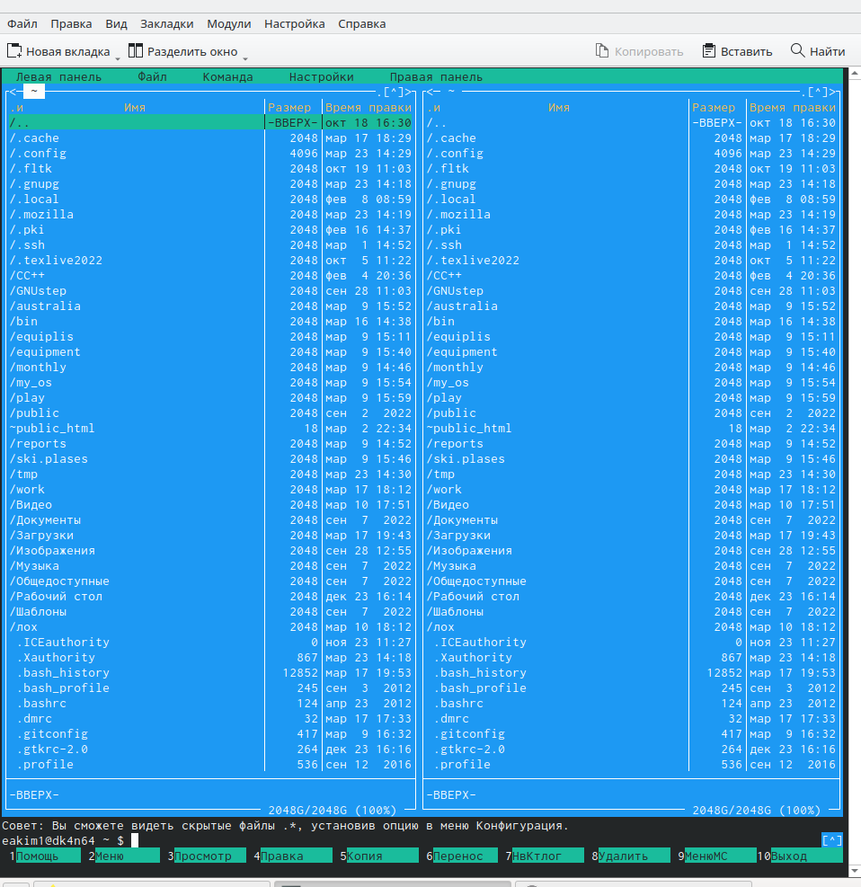
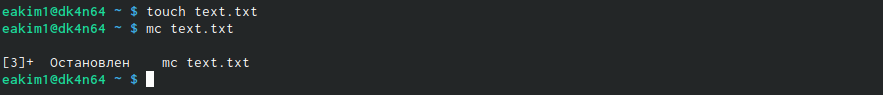
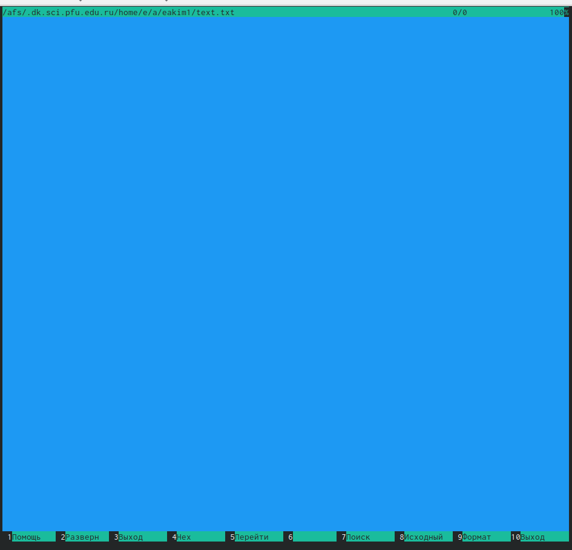
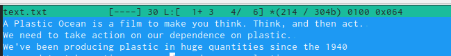
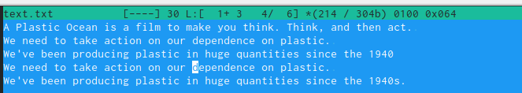
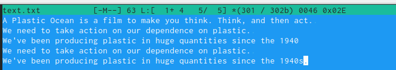
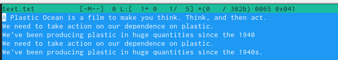
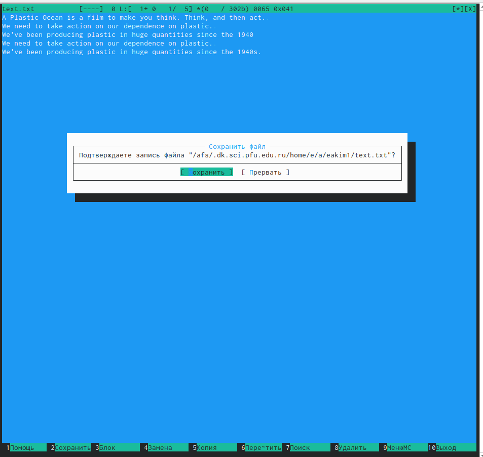
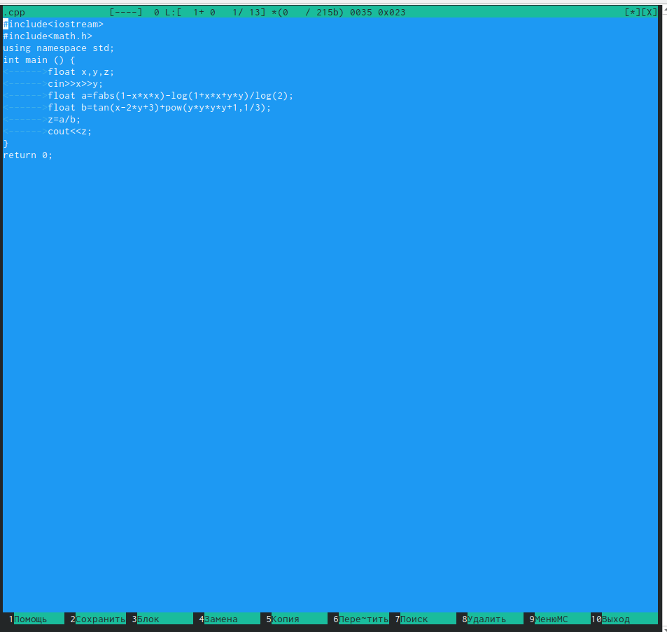

---
## Front matter
title: "Лабораторная рбота №7"
subtitle: "Освоение основных возможностей командной оболочки Midnight Commander. Приобетение навыков практической работы по просмотру каталогов и файлов; манипуляций с ними."
author: "Ким Эрика Алексеевна"

## Generic otions
lang: ru-RU
toc-title: "Содержание"

## Bibliography
bibliography: bib/cite.bib
csl: pandoc/csl/gost-r-7-0-5-2008-numeric.csl

## Pdf output format
toc: true # Table of contents
toc-depth: 2
lof: true # List of figures
lot: true # List of tables
fontsize: 12pt
linestretch: 1.5
papersize: a4
documentclass: scrreprt
## I18n polyglossia
polyglossia-lang:
  name: russian
  options:
	- spelling=modern
	- babelshorthands=true
polyglossia-otherlangs:
  name: english
## I18n babel
babel-lang: russian
babel-otherlangs: english
## Fonts
mainfont: PT Serif
romanfont: PT Serif
sansfont: PT Sans
monofont: PT Mono
mainfontoptions: Ligatures=TeX
romanfontoptions: Ligatures=TeX
sansfontoptions: Ligatures=TeX,Scale=MatchLowercase
monofontoptions: Scale=MatchLowercase,Scale=0.9
## Biblatex
biblatex: true
biblio-style: "gost-numeric"
biblatexoptions:
  - parentracker=true
  - backend=biber
  - hyperref=auto
  - language=auto
  - autolang=other*
  - citestyle=gost-numeric
## Pandoc-crossref LaTeX customization
figureTitle: "Рис."
tableTitle: "Таблица"
listingTitle: "Листинг"
lofTitle: "Список иллюстраций"
lotTitle: "Список таблиц"
lolTitle: "Листинги"
## Misc options
indent: true
header-includes:
  - \usepackage{indentfirst}
  - \usepackage{float} # keep figures where there are in the text
  - \floatplacement{figure}{H} # keep figures where there are in the text
---

# Цель работы

Освоение основных возможностей командной оболочки Midnight Commander. Приобретение навыков практической работы по просмотру каталогов и файлов; манипуляций с ними.

# Выполнение лабораторной работы

1. Запишите в файл file.txt названия файлов, содержащихся в каталоге /etc. Допи-
шите в этот же файл названия файлов, содержащихся в вашем домашнем каталоге

{#fig:001 width=90%}

2. апустите из командной строки mc, изучите его структуру и меню.
 
{#fig:002 width=90%}

3. Создайте текстовой файл text.txt.
 
{#fig:003 width=90%}

4. Откройте этот файл с помощью встроенного в mc редактора.
  
{#fig:004 width=90%} 

5. Вставьте в открытый файл небольшой фрагмент текста, скопированный из любого
другого файла или Интернета.

{#fig:005 width=90%}

6.  Проделайте с текстом следующие манипуляции, используя горячие клавиши:
Выделите фрагмент текста и скопируйте его на новую строку.
  
{#fig:006 width=90%}

7. Перейдите в конец файла (нажав комбинацию клавиш) и напишите некоторый
текст.

{#fig:07 width=90%}

8. Перейдите в начало файла (нажав комбинацию клавиш) и напишите некоторый
текст.

{#fig:08 width=90%}

9. Сохраните и закройте файл.

{#fig:09 width=90%} 

10.  Откройте файл с исходным текстом на некотором языке программирования (напри-
мер C или Java).Используя меню редактора, включите подсветку синтаксиса, если она не включена,
или выключите, если она включена.

{#fig:010 width=90%}

  
  
  
# Выводы

Освоили основные возможности командной оболочки MC.

# Список литературы{.unnumbered}

::: {#refs}
:::
