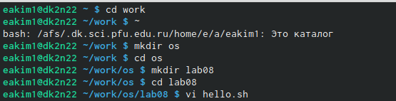
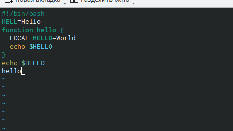
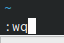
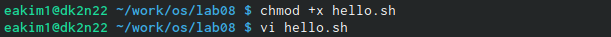
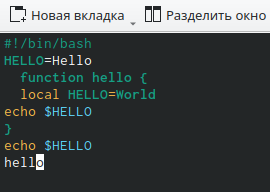
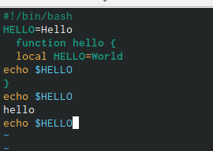
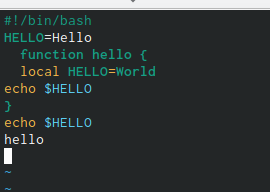
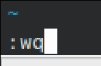

---
## Front matter
lang: ru-RU
title: Лабораторная работа №8
subtitle: Познакомиться с операционной системой Linux. Получить практические навыки работы с редактором vi, установленным по умолчанию практически во всех дистрибутивах.
author:
  - Ким Э.А
institute:
  - Российский университет дружбы народов, Москва, Россия

## i18n babel
babel-lang: russian
babel-otherlangs: english

## Formatting pdf
toc: false
toc-title: Содержание
slide_level: 2
aspectratio: 169
section-titles: true
theme: metropolis
header-includes:
 - \metroset{progressbar=frametitle,sectionpage=progressbar,numbering=fraction}
 - '\makeatletter'
 - '\beamer@ignorenonframefalse'
 - '\makeatother'
---

# Информация

## Докладчик

:::::::::::::: {.columns align=center}
::: {.column width="70%"}

  * Ким Эрика Алексеевна 
  * НБИ-02-22
  * РУДН 

:::
::: {.column width="30%"}

:::
::::::::::::::

## Цели и задачи

- Познакомиться с операционной системой Linux. Получить практические навыки работы с редактором vi, установленным по умолчанию практически во всех дистрибутивах.

## Этапы работы

1. Создайте каталог с именем ~/work/os/lab08.Перейдите во вновь созданный каталог.Вызовите vi и создайте файл hello.sh

{#fig:001 width=90%}

##

2. Нажмите клавишу i и вводите следующий текст.
 
{#fig:002 width=90%}

##

3. Нажмите клавишу Esc для перехода в командный режим после завершения ввода текста.Нажмите : для перехода в режим последней строки и внизу вашего экрана появится приглашение в виде двоеточия.Нажмите w (записать) и q (выйти), а затем нажмите клавишу Enter для сохранения вашего текста и завершения работы..
 
{#fig:003 width=90%}

##

4. Сделайте файл исполняемым
  
{#fig:004 width=90%} 

##

5. Перейдите в режим вставки и замените на HELLO. Нажмите Esc для возврата в командный режим.

{#fig:005 width=90%}

##

6.  Установите курсор на последней строке файла. Вставьте после неё строку, содержащую следующий текст: echo $HELLO
  
{#fig:006 width=90%}

##

7. Нажмите Esc для перехода в командный режим.Удалите последнюю строку.

{#fig:07 width=90%}

##

8. Введите команду отмены изменений u для отмены последней команды. Введите символ : для перехода в режим последней строки. Запишите произведённые изменения и выйдите из vi

{#fig:08 width=90%}

  
## Вывод 

- мы молодцы 

:::
