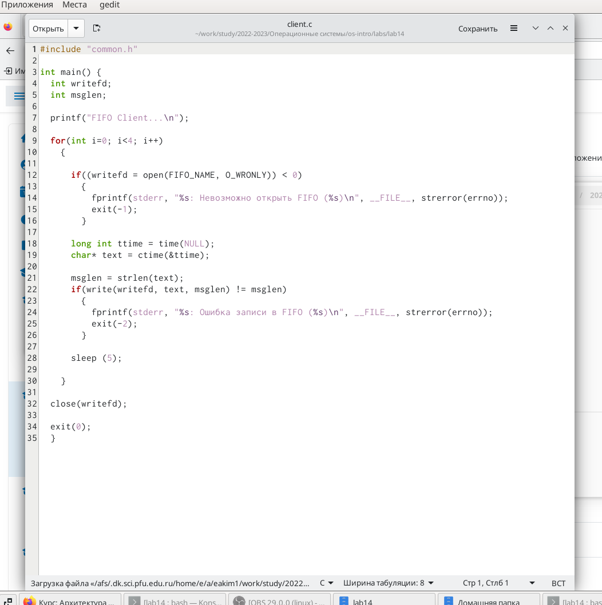
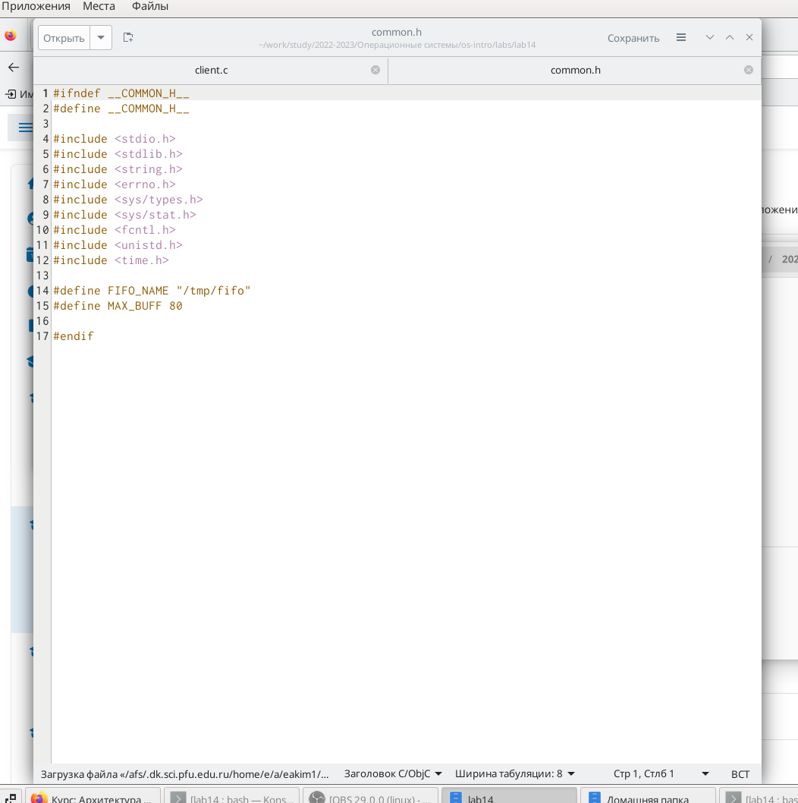
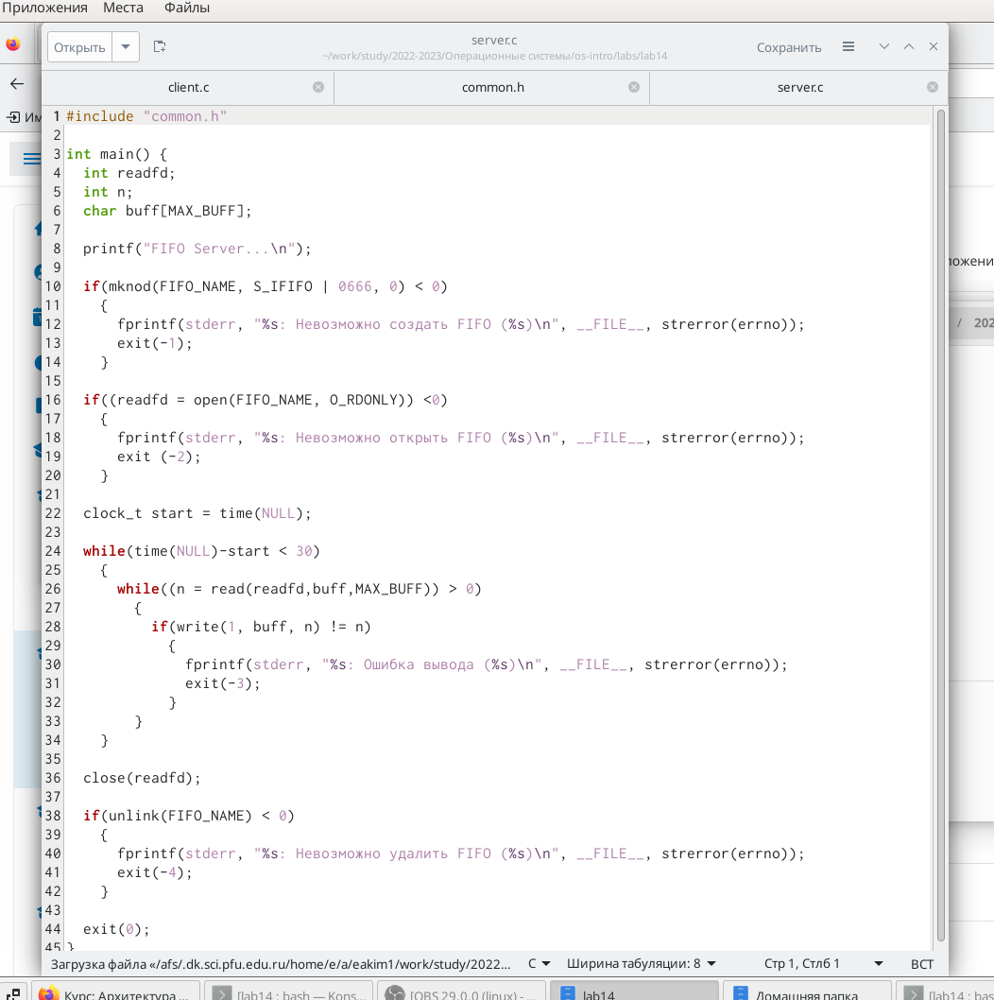
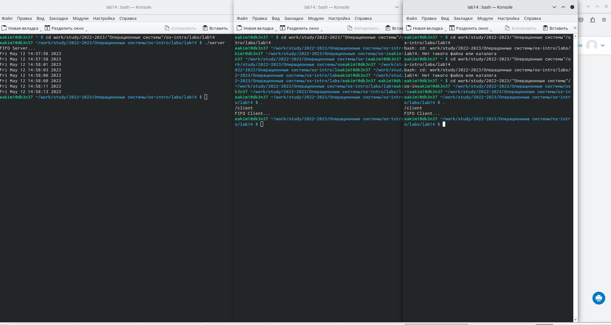

---
## Front matter
lang: ru-RU
title: Лабораторная работа №14
subtitle: Приобретение практических навыков работы с именованными каналами
author:
  - Ким Э.А
institute:
  - Российский университет дружбы народов, Москва, Россия

## i18n babel
babel-lang: russian
babel-otherlangs: english

## Formatting pdf
toc: false
toc-title: Содержание
slide_level: 2
aspectratio: 169
section-titles: true
theme: metropolis
header-includes:
 - \metroset{progressbar=frametitle,sectionpage=progressbar,numbering=fraction}
 - '\makeatletter'
 - '\beamer@ignorenonframefalse'
 - '\makeatother'
---

# Информация

## Докладчик

:::::::::::::: {.columns align=center}
::: {.column width="70%"}

  * Ким Эрика Алексеевна 
  * НБИ-02-22
  * РУДН 

:::
::: {.column width="30%"}

:::
::::::::::::::

## Цели и задачи

- Приобретение практических навыков работы с именованными каналами

## Этапы работы

1. Создать и заполнить файлы server, client, common.

{#fig:001 width=90%}

##

{#fig:002 width=90%}

##

{#fig:003 width=90%}

##

2. Открыть 3 консоли и запустить программу, в течении 30 секунд она должна перестать работать. .

{#fig:004 width=90%}

  
## Вывод 

- мы молодцы 

:::
