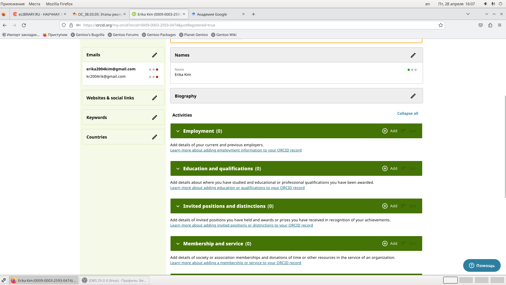

---
## Front matter
lang: ru-RU
title: "Индивидуальный проект 4"
subtitle: "Добавить пост."
author:
  - Ким Эрика Алексеевна
institute:
  - Российский университет дружбы народов, Москва, Россия
date: 28 апреля 2023 г.

## i18n babel
babel-lang: russian
babel-otherlangs: english

## Formatting pdf
toc: false
toc-title: Содержание
slide_level: 2
aspectratio: 169
section-titles: true
theme: metropolis
header-includes:
 - \metroset{progressbar=frametitle,sectionpage=progressbar,numbering=fraction}
 - '\makeatletter'
 - '\beamer@ignorenonframefalse'
 - '\makeatother'
---

# Информация

## Докладчик

:::::::::::::: {.columns align=center}
::: {.column width="70%"}

  * Ким Эрика Алексеевна
  * студент группы НБИбд-02-22
  * Российский университет дружбы народов
  
:::
::: {.column width="30%"}

:::
::::::::::::::

## Цели и задачи

Приобретение практических навыков взаимодействия пользователя с системой по-
средством командной строки.

## Содержание исследования

1. Зарегестрироваться на сайтах. 

{#fig:001 width=90%}

##

{#fig:001 width=90%}

##

{#fig:001 width=90%}

##

{#fig:001 width=90%}

##

{#fig:001 width=90%

##

{#fig:001 width=90%}

##

{#fig:001 width=90%}

##

{#fig:001 width=90%}

##

2. Написать пост

{#fig:002 width=90%}

## Результаты

- Мы молодцы

## Итоговый слайд

Сделали 4 этап

:::
